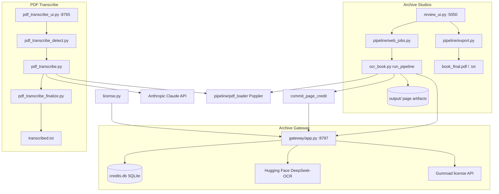

# OCR Book Pipeline — System Architecture

> **Canonical architecture reference:** [CLAUDE_ARCHITECTURE_REFERENCE.md](./CLAUDE_ARCHITECTURE_REFERENCE.md) — single source of truth for module maps, APIs, and implementation details; this doc is an operator-oriented overview.

Comprehensive map of what this repository does, how the pieces connect, and what happens at each step. Written for operators (you) and future development.

**Two products live in one repo.** They share some utilities (`pipeline/paths`, Poppler) but use different OCR engines, UIs, licensing, and output layouts.


| Product             | What it does                                                         | UI / entry             | Port |
| ------------------- | -------------------------------------------------------------------- | ---------------------- | ---- |
| **Archive Studios** | 3-pass DeepSeek OCR on book photos/PDFs → human review → export      | `review_ui.py`         | 5050 |
| **PDF Transcribe**  | 2-pass Claude Opus vision on scanned PDFs → reconcile → name patches | `pdf_transcribe_ui.py` | 8765 |
| **Archive Gateway** | Gumroad license + credits + proxy to Hugging Face DeepSeek-OCR       | `gateway/app.py`       | 8787 |


Deep dive for PDF Transcribe only: [PDF_TRANSCRIBE_PIPELINE.md](./PDF_TRANSCRIBE_PIPELINE.md)

---

## 1. High-level system map




**Key separation:** Archive Studios never talks to Claude. PDF Transcribe never talks to the Gateway (direct Anthropic API + local settings).

---

## 2. Design principles (both products)

### Archive Studios

- **Never modify originals** (photos/PDFs on disk stay untouched)
- **Never auto-correct** indigenous or secondary language text
- **Never majority-vote** — if engines disagree, flag for human review
- **Never silently drop** content — images become `[IMAGE]` markers
- Footnotes and image regions are **always flagged** for review
- Credits charged **only after** a page completes successfully (idempotent commit)

### PDF Transcribe

- **Page image is ground truth** — reconcile picks what matches the scan, not what “sounds right”
- **Never normalize** colonial spelling (old Spanish, Nahuatl macrons, Maya orthography, etc.)
- **Two independent passes** then reconcile only on **content** diffs (whitespace-only disagreements skip reconcile)
- **Sentence-level spot patches** on hard terms — never replace whole pages
- **Intent-based detection (v3)** — language, script, and term lists inferred from the book; you confirm before full spend

---

## 3. Archive Studios — end-to-end

### 3.1 How you start it


| Launcher                                                  | What it runs                                            |
| --------------------------------------------------------- | ------------------------------------------------------- |
| `Launch Archive Studios.bat` / `Launch OCR Review UI.bat` | `Launch-OCR.ps1` → `.venv` + `review_ui.py --port 5050` |
| CLI                                                       | `python ocr_book.py <photos_or_pdf> <output_dir>`       |
| Frozen installer                                          | PyInstaller build `Archive Studios.exe` (see §8)        |


**Prerequisite for OCR:** Archive Gateway running (`scripts/run_gateway.ps1`) with `ARCHIVE_GUMROAD_PRODUCT_ID` and `ARCHIVE_HF_TOKEN`.

### 3.2 Review UI (`review_ui.py`)

Flask app — templates in `templates/`, assets in `static/`.


| Screen                          | Template        | JS/CSS                 |
| ------------------------------- | --------------- | ---------------------- |
| Home (upload, run OCR, credits) | `home.html`     | `home.js`, `app.css`   |
| Page review                     | `review.html`   | `review.js`, `app.css` |
| License activation              | `activate.html` | inline + `app.css`     |


**Important API routes:**


| Route                     | Purpose                                                |
| ------------------------- | ------------------------------------------------------ |
| `POST /api/upload`        | Accept photos or PDF                                   |
| `POST /api/run-ocr`       | Start background job → `pipeline.web_jobs.start_job()` |
| `GET /api/manifest`       | List pages and review status                           |
| `GET /api/page/<id>`      | Page image, runs, flags, draft text                    |
| `POST /api/save`          | Save human edits per page                              |
| `POST /api/export`        | Build `book_final.pdf` + `book_final.txt`              |
| `POST /api/activate`      | Gumroad key → Gateway → `activation.json`              |
| `GET /api/credits`        | Remaining page credits                                 |
| `GET/POST /api/languages` | Tesseract language packs for project                   |


**Keyboard shortcuts (review):** J/K flags, Enter accept, N/P pages, S save.

**Data directories:**

- Dev: `photos/` + `output/` in repo
- Frozen exe: `%LOCALAPPDATA%\Archive Studios\photos` and `output`

### 3.3 Background jobs (`pipeline/web_jobs.py`)

1. UI uploads files into project folder
2. `start_job()` spawns thread calling `ocr_book.run_pipeline()`
3. `keep_system_awake()` prevents Windows sleep during long runs
4. `append_progress_log()` writes JSONL to `ocr_progress.log`
5. UI polls job status

### 3.4 Main pipeline (`ocr_book.py`)

**Entry:** `run_pipeline(input_path, output_dir, ...)`

**Per-page flow (`process_page`):**

```
1. load_bgr()                    — read image
2. light_preprocess()            — pass C only (deskew/contrast)
3. run_four_passes()             — 3× DeepSeek via Gateway
       Run A: original image
       Run B: original (sampling variation)
       Run C: preprocessed image
4. compose_page_text()           — layout: body + footnotes + [IMAGE] markers
5. normalize_line_breaks()       — hyphen/line-break cleanup
6. apply_secondary_placeholders()— indigenous/secondary language tagging
7. detect_language_switching()   — flag language-boundary issues
8. analyze_runs()                — strict consensus → FlaggedSpan list
9. Write artifacts (see §3.5)
10. commit_page_credit()         — 1 credit/page, idempotent key = page_id
```

**Parallelism:** `ThreadPoolExecutor` (2–4 workers) across pages.

**Resume:** `project_state.json` tracks completed pages; re-run skips finished pages.

### 3.5 Archive Studios output artifacts

Under your chosen `output/` directory:


| File                                  | Meaning                                                              |
| ------------------------------------- | -------------------------------------------------------------------- |
| `project.json`                        | Book title, languages, thresholds                                    |
| `languages.json`                      | Per-project language settings (may override `config/languages.json`) |
| `project_state.json`                  | Resume state                                                         |
| `manifest.json`                       | Page index for UI                                                    |
| `page_NNN_runA.txt` / `runB` / `runC` | Raw engine outputs                                                   |
| `page_NNN_draft.txt`                  | Best draft text (not final)                                          |
| `page_NNN_consensus.json`             | Flags, spans, engine agreement                                       |
| `page_NNN_review.csv`                 | Review queue for UI                                                  |
| `page_NNN_source.jpg`                 | Source image served to UI                                            |
| `book_draft.txt`                      | Concatenated draft                                                   |
| `book_review_needed.txt`              | Pages/spans needing eyes                                             |
| `ocr_progress.log`                    | JSONL job log                                                        |
| `review_state.json`                   | Saved UI edits (gitignored)                                          |
| `book_final.pdf` / `book_final.txt`   | After Export                                                         |


### 3.6 OCR engines (`pipeline/ocr_engines.py`)

**Primary:** Three DeepSeek-OCR calls per page through **Gateway** (`pipeline/gateway_client.request_ocr()`).

**Fallback:** Tesseract word boxes when DeepSeek returns text-only (for flag positioning).

**Not primary anymore:** PaddleOCR — still bundled in `vendor/` for offline installer legacy, not the live OCR path.

### 3.7 Consensus (`pipeline/consensus.py`)

- Compares token-level output across runs A/B/C
- **Does not** pick majority and move on
- Any disagreement → `FlaggedSpan` with reason, bbox, per-engine text
- `pick_draft_text()` chooses a starting draft for review, not a final truth
- `build_review_needed()` aggregates human queue

### 3.8 Layout & language helpers


| Module                         | Role                                                              |
| ------------------------------ | ----------------------------------------------------------------- |
| `pipeline/layout.py`           | Footnote regions, image detection, `--- FOOTNOTES ---`, `[IMAGE]` |
| `pipeline/language.py`         | Secondary language placeholders, switching detection              |
| `pipeline/lang_catalog.py`     | UI language picker; reads `config/tesseract_languages.json`       |
| `pipeline/tessdata_manager.py` | Download missing tessdata on demand                               |
| `pipeline/text_cleanup.py`     | Line-break / hyphen normalization between words                   |
| `pipeline/preprocess.py`       | Light preprocess for pass C                                       |
| `pipeline/pdf_loader.py`       | PDF → PNG via Poppler (`pdf_to_page_images`, `collect_inputs`)    |
| `pipeline/export.py`           | `book_final.pdf` + plain text from reviewed pages                 |
| `pipeline/paths.py`            | Resolve Tesseract, Poppler, Paddle paths (dev / vendor / frozen)  |
| `pipeline/paddle_env.py`       | Disable oneDNN before any Paddle import                           |
| `pipeline/progress_log.py`     | Append-only progress JSONL                                        |
| `pipeline/system_keepawake.py` | Windows “don’t sleep” during jobs                                 |


---

## 4. Archive Gateway

### 4.1 Purpose

Sits between Archive Studios and Hugging Face so that:

- Gumroad license keys activate **page credits**
- OCR requests carry license validation
- HF token stays on the server, not in the sold app
- Credits deduct **after** successful page processing (commit endpoint)

### 4.2 Components


| File                         | Role                                                             |
| ---------------------------- | ---------------------------------------------------------------- |
| `gateway/app.py`             | FastAPI: `/activate`, `/ocr/page`, `/credits`, `/credits/commit` |
| `gateway/store.py`           | SQLite `CreditStore` — licenses + credit_events                  |
| `pipeline/gateway_client.py` | Client used by `ocr_book.py` and `license.py`                    |
| `config/gateway.json`        | Default URL `http://127.0.0.1:8787`                              |
| `config/product.json`        | `gumroad_product_id`, `license_required`, dev flags              |


**Database default:** `%USERPROFILE%\.archive_gateway\credits.db`

### 4.3 Credit flow

```
Activate license (once) → credits balance in SQLite
     ↓
Each OCR page: request_ocr() — no deduction yet
     ↓
Page completes in ocr_book → commit_page_credit(idempotency_key=page_id)
     ↓
Gateway deducts 1 credit (safe to retry same page_id)
```

### 4.4 License module (`license.py`)

- Reads `config/product.json`
- Stores activation in `%LOCALAPPDATA%\Archive Studios\activation.json`
- `license_required()` respects dev skip flags (`VERBATIM_DEV`, `dev_skip_license`)
- `credits_status()` polls Gateway for balance

---

## 5. PDF Transcribe — end-to-end

### 5.1 How you start it


| Launcher                    | What it runs                                                                   |
| --------------------------- | ------------------------------------------------------------------------------ |
| `Launch PDF Transcribe.bat` | Kill port 8765, check Claude key, `pdf_transcribe_ui.py`                       |
| `Save Claude Key.bat`       | `scripts/save_claude_key.py` → `%LOCALAPPDATA%\PDF Transcribe\settings.json`   |
| CLI                         | `python pdf_transcribe.py book.pdf [--source-name X] [--max-pages 10] [--yes]` |


**API key storage:** `%LOCALAPPDATA%\PDF Transcribe\settings.json` (model, processing mode, optional defaults).

**Uploads:** `_pdf_transcribe_uploads/{safe_filename}.pdf`

**Work dir:** `_pdf_transcribe_uploads/{pdf_stem}_transcribe_output/`

### 5.2 Module map


| Module                       | Responsibility                                                           |
| ---------------------------- | ------------------------------------------------------------------------ |
| `pdf_transcribe.py`          | Core engine: render PDF, Claude API (live + batch), state, progress, CLI |
| `pdf_transcribe_ui.py`       | Flask UI: prepare → detect → confirm → transcribe                        |
| `pdf_transcribe_detect.py`   | Phase 0 detection, post-run1 term extraction, per-source config save     |
| `pdf_transcribe_lang.py`     | Languages, normalization rules, hard terms, impossible strings           |
| `pdf_transcribe_spot.py`     | Sentence-level patch ops + validation                                    |
| `pdf_transcribe_sanity.py`   | Batch output script/length checks + live re-run                          |
| `pdf_transcribe_finalize.py` | Reconcile, spot batch, `transcribed.txt`, `run_summary.txt`              |


### 5.3 Pipeline phases (summary)


| Phase             | UI message (typical)              | What happens                                                      |
| ----------------- | --------------------------------- | ----------------------------------------------------------------- |
| **0 Detect**      | Analyzing sample pages…           | Up to 10 stratified sample images → language/script/terms profile |
| **0b Confirm**    | Detected source profile           | You approve or override                                           |
| **Render**        | Converting PDF…                   | 300 DPI grayscale PNGs in `images/`                               |
| **Run 1**         | Run 1 — N pages queued            | First full transcription pass                                     |
| **Extract terms** | Extracting hard terms from run 1… | Merge seeds + run1 text → auto hard/impossible files              |
| **Run 2**         | Run 2 — N pages queued            | Second pass with updated context                                  |
| **Sanity**        | Re-running batch collisions…      | Bad batch pages re-run live                                       |
| **Reconcile**     | Reconciling N pages…              | Image-based merge where run1 ≠ run2 (content); pass 4 if third reading |
| **Spot**          | Spot patches: N sentences…        | Per-sentence name/term verification                               |
| **Done**          | All finished!                     | `transcribed.txt` + summary + saved `config/sources/{name}.json`  |


Full step-by-step, error avoidance, and file glossary: **[PDF_TRANSCRIBE_PIPELINE.md](./PDF_TRANSCRIBE_PIPELINE.md)**

### 5.4 Final text priority (per page)

```
spot_check/page_XXXX.txt
  → else reconcile/page_XXXX.txt
  → else run1 if run1/run2 differ only in whitespace
  → else run1
```

### 5.5 Processing modes


| Setting          | Test (10 pages) | Full book       |
| ---------------- | --------------- | --------------- |
| **Recommended**  | Live API        | Batch (50% off) |
| **Always live**  | Live            | Live            |
| **Always batch** | Batch           | Batch           |


Phase 0 detection and hard-term extraction always use **live** API calls.

### 5.6 Config files (PDF Transcribe)


| Path                                  | Role                                     |
| ------------------------------------- | ---------------------------------------- |
| `config/transcription_prompt.txt`     | Base Claude transcription prompt         |
| `config/transcribe_languages.json`    | Per-language script/emphasis metadata    |
| `config/hard_terms_{source}.txt`      | Manual per-source terms (legacy/default) |
| `config/hard_terms_auto_{source}.txt` | v3 auto-generated terms                  |
| `config/impossible_auto_{source}.txt` | Auto typo variants to reject             |
| `config/sources/{source}.json`        | Saved detection profile for re-runs      |


---

## 6. Shared infrastructure

### 6.1 `pipeline/paths.py`

Resolves bundled tools for dev, `vendor/`, or PyInstaller frozen exe:

- Tesseract executable + tessdata
- Poppler `pdftoppm`
- Paddle model dirs (installer legacy)

Called via `configure_runtime()` at startup in `ocr_book.py` and transcribe PDF rendering.

### 6.2 Poppler

Required for **any PDF input** in both products:

- Archive Studios: `pipeline/pdf_loader.py`
- PDF Transcribe: `pdf_transcribe.render_pdf_pages()`

Install via system PATH or `vendor/poppler/` (populated by `scripts/populate_vendor.ps1`).

### 6.3 Tesseract

Used for:

- Word bbox fallback in Archive Studios
- Google Books boilerplate detection in PDF Transcribe (`is_google_books_boilerplate`)
- On-demand language pack downloads (`tessdata_manager`)

---

## 7. Configuration reference (`config/`)


| File                                  | Used by                           |
| ------------------------------------- | --------------------------------- |
| `product.json`                        | Archive Studios licensing         |
| `gateway.json`                        | Gateway client URL                |
| `languages.json`                      | Archive Studios default languages |
| `tesseract_languages.json`            | Review UI language catalog        |
| `transcribe_languages.json`           | PDF Transcribe language metadata  |
| `transcription_prompt.txt`            | PDF Transcribe Claude prompt      |
| `hard_terms*.txt` / `impossible*.txt` | PDF Transcribe term lists         |
| `sources/*.json`                      | PDF Transcribe saved profiles     |


**Runtime overrides:** `output/project.json`, `output/languages.json` per Archive Studios book.

---

## 8. Build, packaging, distribution

### Archive Studios installer

```
scripts/populate_vendor.ps1   → vendor/tesseract, poppler, tessdata, paddlex
build/archive_studios.spec  → PyInstaller one-folder exe
build/installer.iss           → Inno Setup installer
scripts/build_installer.ps1   → full pipeline
```

**Entry binary:** `review_ui.py` → **Archive Studios.exe**

**Bundled:** `templates/`, `static/`, `config/` (not secrets)

### PDF Transcribe

**Not PyInstaller-packaged** in current setup — runs from source via `.bat` launchers and `requirements-pdf-transcribe.txt`.

---

## 9. Scripts directory (operator tools)


| Script                        | Product         | Purpose                               |
| ----------------------------- | --------------- | ------------------------------------- |
| `run_gateway.ps1`             | Gateway         | Start uvicorn on 8787                 |
| `save_claude_key.py`          | PDF Transcribe  | Save Anthropic key                    |
| `verify_engines.py`           | Archive Studios | Test 3-pass + consensus               |
| `qa_test_mode.py`             | Gateway/Archive | Automated QA (credits, resume)        |
| `test_transcribe_logic.py`    | PDF Transcribe  | Offline unit tests (no API)           |
| `find_pilot_pages.py`         | PDF Transcribe  | Pick 20 pilot pages from prior output |
| `audit_spot_pilot.py`         | PDF Transcribe  | Audit spot-patch coverage             |
| `bundle_transcribe_output.py` | PDF Transcribe  | One-file text bundle                  |
| `analyze_run_disagreement.py` | PDF Transcribe  | Compare run1 vs run2                  |
| `preprocess_iphone_photos.py` | PDF Transcribe  | Prep phone photos                     |
| `populate_vendor.ps1`         | Build           | Bundle offline OCR tools              |
| `bundle_tessdata.ps1`         | Build           | Download tessdata packs               |
| `build_installer.ps1`         | Build           | Full Windows installer                |
| `sync_notion_status.py`       | CI              | Push `status.json` to Notion          |


---

## 10. Runtime & gitignored locations


| Path                                                   | Contents                                  |
| ------------------------------------------------------ | ----------------------------------------- |
| `output/`                                              | Archive Studios OCR artifacts             |
| `photos/`                                              | Dev upload folder                         |
| `_pdf_transcribe_uploads/`                             | PDF Transcribe PDFs + work dirs           |
| `*_transcribe_output/`                                 | PDF Transcribe output (may be beside PDF) |
| `review_state.json`                                    | Review UI saved edits                     |
| `vendor/tesseract`, `vendor/poppler`, `vendor/paddlex` | Large binaries (not in git)               |
| `dist/`                                                | PyInstaller output                        |
| `.venv/`                                               | Python environment                        |
| `%LOCALAPPDATA%\Archive Studios\activation.json`       | License                                   |
| `%LOCALAPPDATA%\PDF Transcribe\settings.json`          | Claude key + settings                     |
| `%USERPROFILE%\.archive_gateway\credits.db`            | Gateway credits                           |


---

## 11. External services & dependencies

### Python (`requirements.txt` vs `requirements-pdf-transcribe.txt`)

Archive Studios: numpy, opencv, pytesseract, Flask, fpdf2, pypdf, pdf2image, requests, fastapi, uvicorn, huggingface_hub

PDF Transcribe subset: pdf2image, requests, Pillow, Flask, pypdf

### Services


| Service                   | Product         | Env / config                                |
| ------------------------- | --------------- | ------------------------------------------- |
| Hugging Face DeepSeek-OCR | Archive Studios | `ARCHIVE_HF_TOKEN` on Gateway               |
| Gumroad license verify    | Archive Studios | `ARCHIVE_GUMROAD_PRODUCT_ID`                |
| Anthropic Claude API      | PDF Transcribe  | Key in settings.json or `ANTHROPIC_API_KEY` |


### Local binaries


| Tool      | Role                                        |
| --------- | ------------------------------------------- |
| Poppler   | PDF → images                                |
| Tesseract | Bbox fallback, boilerplate detect, tessdata |
| OpenCV    | Image I/O, preprocess, layout               |


---

## 12. CI & project metadata


| Path                                | Role                                    |
| ----------------------------------- | --------------------------------------- |
| `status.json`                       | Feature/build checklist                 |
| `.github/workflows/notion-sync.yml` | Sync status to Notion on push to `main` |
| `docs/GUMROAD_LISTING.md`           | Product copy                            |
| `docs/NOTION_STATUS_SETUP.md`       | Notion integration setup                |


---

## 13. Operator playbook — minimizing errors

### Archive Studios

1. Start Gateway before OCR
2. Activate license; confirm credits
3. Set `project.json` languages before a big run
4. Review **every flagged span** — nothing auto-accepts
5. Export only after review pass
6. Use PDF page range tools in UI for partial books

### PDF Transcribe

1. **Name the source** once per book/edition
2. **10-page test** before full book
3. **Confirm detection profile** — fix wrong language mix
4. Skip Google notice pages when applicable
5. Read `run_summary.txt` → `human_review_pages`, `batch_collisions`
6. Re-run with same source name resumes; loads saved profile
7. See [PDF_TRANSCRIBE_PIPELINE.md](./PDF_TRANSCRIBE_PIPELINE.md) § “How to get as close to zero errors”

---

## 14. Which product when?


| Your input                                                    | Best tool                            |                     |
| ------------------------------------------------------------- | ------------------------------------ | ------------------- |
|                                                               | iPhone photos of physical book pages | **Archive Studios** |
| PDF from Google Books / archive scan                          | **PDF Transcribe** (Claude vision)   |                     |
| Need pixel-level flag review UI                               | **Archive Studios**                  |                     |
| Need full-book verbatim transcription with 2-pass + reconcile | **PDF Transcribe**                   |                     |
| Selling to customers with Gumroad credits                     | **Archive Studios** + Gateway        |                     |
| Personal research PDFs with your own Claude key               | **PDF Transcribe**                   |                     |


---

## 15. Version notes

- **Archive Studios:** 3-pass DeepSeek via Gateway, strict consensus, review UI export
- **PDF Transcribe:** v3 intent-based auto-detection, stratified sampling, auto hard terms, batch sanity, spot-check v2
- **Gateway:** License + credit proxy to HF DeepSeek-OCR

*Last aligned with repo `main` — PDF Transcribe v3 + Gateway pivot architecture.*