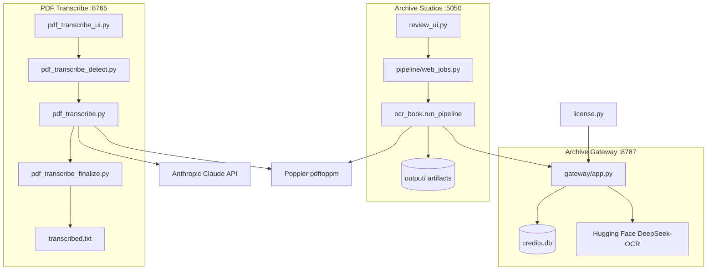
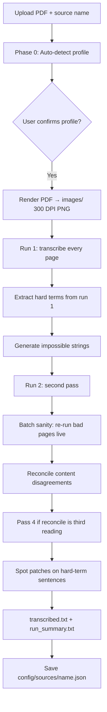

# OCR Book Pipeline — Full Architecture Reference (for LLM analysis)

**Purpose:** Single self-contained document describing the entire `ocr-book-pipeline` repository — three products, all modules, data flows, file layouts, APIs, and design rules. Intended to be pasted or attached to Claude (or another LLM) for code review, debugging, or feature design.

**Repository:** `C:\Users\drewc\Projects\ocr-book-pipeline`  
**Last updated:** 2026-06-10 (canonical doc; includes PDF Transcribe reconcile **pass 4** cross-check)

---

## 1. Executive summary

This repo contains **three related but separate products**:

| Product | Engine | UI | Port | Billing |
|---------|--------|-----|------|---------|
| **Archive Studios** | 3× DeepSeek-OCR via Gateway | `review_ui.py` | 5050 | Gumroad page credits |
| **PDF Transcribe** | 2× Claude Opus vision + reconcile + spot patches | `pdf_transcribe_ui.py` | 8765 | User's Anthropic API key |
| **Archive Gateway** | Proxies HF DeepSeek-OCR | `gateway/app.py` | 8787 | SQLite credits DB |

**Shared:** Poppler PDF rendering (`pipeline/paths.py`, `pipeline/pdf_loader.py`), some config under `config/`, Windows `.bat` launchers.

**Not shared:** Archive Studios never calls Claude. PDF Transcribe never calls the Gateway.

---

## 2. Repository file tree (key paths)

```
ocr-book-pipeline/
├── ocr_book.py                 # Archive Studios CLI pipeline entry
├── review_ui.py                # Archive Studios Flask UI (:5050)
├── license.py                  # Gumroad activation client
├── pdf_transcribe.py           # PDF Transcribe core engine
├── pdf_transcribe_ui.py        # PDF Transcribe Flask UI (:8765)
├── pdf_transcribe_detect.py    # Phase 0 detection + post-run1 term extraction
├── pdf_transcribe_lang.py      # Language profiles, normalization, term matching
├── pdf_transcribe_source.py    # Source identity, section hints, soft terms
├── pdf_transcribe_spot.py        # Sentence-level spot patch ops + validation
├── pdf_transcribe_sanity.py      # Batch output sanity + live re-run
├── pdf_transcribe_finalize.py    # Reconcile, pass 4, spot batch, transcribed.txt
├── pdf_transcribe_assembly.py    # Cross-page bracket rejoin logic
├── pdf_transcribe_integrity.py   # Source lock, pilot checks, startup heal
│
├── pipeline/                     # Archive Studios shared library
│   ├── ocr_engines.py          # DeepSeek via gateway_client
│   ├── consensus.py            # Flag disagreements (no majority vote)
│   ├── layout.py               # Footnotes, images, [IMAGE] markers
│   ├── language.py             # Secondary language placeholders
│   ├── pdf_loader.py           # PDF → PNG (Poppler)
│   ├── export.py               # book_final.pdf / .txt
│   ├── web_jobs.py             # Background OCR jobs for review UI
│   ├── gateway_client.py       # HTTP client to Archive Gateway
│   ├── paths.py                # Resolve Tesseract, Poppler, Paddle
│   └── ...
│
├── gateway/
│   ├── app.py                  # FastAPI: activate, OCR, credits
│   └── store.py                # SQLite CreditStore
│
├── config/
│   ├── product.json            # Gumroad product id, license flags
│   ├── gateway.json            # Gateway URL
│   ├── transcription_prompt.txt
│   ├── transcribe_languages.json
│   ├── hard_terms*.txt / impossible*.txt
│   └── sources/{name}.json     # Saved PDF Transcribe profiles
│
├── templates/                  # Flask HTML (both UIs)
├── static/                     # JS/CSS
├── scripts/                    # Operator + test scripts
├── docs/
│   ├── ARCHITECTURE.md         # Operator-oriented system map
│   ├── PDF_TRANSCRIBE_PIPELINE.md
│   └── CLAUDE_ARCHITECTURE_REFERENCE.md  # (this file)
│
├── _pdf_transcribe_uploads/    # gitignored — PDF Transcribe work dirs
├── output/                     # gitignored — Archive Studios artifacts
└── photos/                     # gitignored — dev uploads
```

---

## 3. System diagram (all products)



---

## 4. Archive Studios

### 4.1 Design rules (non-negotiable)

- Never modify original photos/PDFs on disk
- Never auto-correct indigenous or secondary language text
- Never majority-vote — disagreements → human review flags
- Never silently drop content — images become `[IMAGE]` markers
- Footnotes and image regions always flagged
- Credits charged only after successful page completion (idempotent commit)

### 4.2 Pipeline (`ocr_book.py`)

**Entry:** `run_pipeline(input_path, output_dir, ...)`

**Per page (`process_page`):**

```
load_bgr → light_preprocess (pass C only)
→ run_four_passes (A: original, B: original w/ variation, C: preprocessed)
→ compose_page_text (body + footnotes + [IMAGE])
→ normalize_line_breaks
→ apply_secondary_placeholders
→ detect_language_switching
→ analyze_runs (strict consensus → FlaggedSpan[])
→ write artifacts
→ commit_page_credit(page_id) via Gateway
```

**Parallelism:** `ThreadPoolExecutor` (2–4 workers). **Resume:** `project_state.json`.

### 4.3 Review UI API (`review_ui.py`)

| Route | Purpose |
|-------|---------|
| `POST /api/upload` | Accept photos or PDF |
| `POST /api/run-ocr` | Background job → `web_jobs.start_job()` |
| `GET /api/manifest` | Page list + review status |
| `GET /api/page/<id>` | Image, runs, flags, draft |
| `POST /api/save` | Human edits per page |
| `POST /api/export` | `book_final.pdf` + `book_final.txt` |
| `POST /api/activate` | Gumroad → Gateway → `activation.json` |
| `GET /api/credits` | Remaining credits |

### 4.4 Output artifacts (`output/`)

| File | Role |
|------|------|
| `manifest.json` | UI page index |
| `page_NNN_runA/B/C.txt` | Raw engine outputs |
| `page_NNN_draft.txt` | Starting draft (not final) |
| `page_NNN_consensus.json` | Flags, spans, agreement |
| `page_NNN_review.csv` | Review queue |
| `book_final.pdf` / `.txt` | After export |

### 4.5 Key `pipeline/` modules

| Module | Role |
|--------|------|
| `ocr_engines.py` | 3× DeepSeek via `gateway_client.request_ocr()` |
| `consensus.py` | Token compare → `FlaggedSpan`; no auto-accept |
| `layout.py` | Footnote regions, `--- FOOTNOTES ---`, `[IMAGE]` |
| `language.py` | Secondary language tagging |
| `pdf_loader.py` | PDF → PNG |
| `export.py` | Final PDF/text from reviewed pages |
| `web_jobs.py` | Threaded jobs + `ocr_progress.log` JSONL |
| `gateway_client.py` | Activate, OCR, credits, commit |

---

## 5. Archive Gateway

**Purpose:** Hide HF token; validate Gumroad licenses; track page credits; proxy OCR.

| Endpoint | Role |
|----------|------|
| `POST /activate` | License key → credit balance |
| `POST /ocr/page` | DeepSeek OCR for one page image |
| `POST /credits/commit` | Deduct 1 credit (idempotent by page_id) |
| `POST /credits` | Balance query |

**DB:** `%USERPROFILE%\.archive_gateway\credits.db` (`gateway/store.py`)

**Credit flow:** OCR request does not deduct → `ocr_book` commits after page success → safe retry on same `page_id`.

---

## 6. PDF Transcribe (primary focus)

### 6.1 Design rules

- **Page image is ground truth** — reconcile picks what matches the scan
- **Never normalize** colonial spelling (old Spanish, Nahuatl macrons, Maya orthography)
- **Two independent transcription passes** then reconcile only on **content** diffs
- Whitespace-only run1/run2 disagreements skip reconcile API calls
- **Sentence-level spot patches** on hard terms — never replace whole pages
- **Intent-based detection (v3)** — language/script/terms inferred; user confirms before full spend

### 6.2 Module responsibilities

| Module | Responsibility |
|--------|----------------|
| `pdf_transcribe.py` | PDF render, Claude API (live + Anthropic batch), state, progress, CLI, assembly helpers |
| `pdf_transcribe_ui.py` | Flask UI: prepare → detect → confirm → transcribe |
| `pdf_transcribe_detect.py` | Phase 0 stratified sampling; post-run1 hard term + impossible string extraction |
| `pdf_transcribe_lang.py` | `job_language_config`, normalization rules, `strip_whitespace_for_compare`, term presence |
| `pdf_transcribe_source.py` | Source slug, page section classification, soft term promotion, spot op collection |
| `pdf_transcribe_spot.py` | Bracket terms in sentences, patch validation, `apply_all_patches` |
| `pdf_transcribe_sanity.py` | Batch length/script checks; live re-run of bad pages |
| `pdf_transcribe_finalize.py` | Reconcile + **pass 4**, spot batch, `transcribed.txt`, `run_summary.txt` |
| `pdf_transcribe_assembly.py` | Cross-page `[` `]` bracket fragment rejoin |
| `pdf_transcribe_integrity.py` | Source lock headers, pilot report, startup state heal |

### 6.3 End-to-end pipeline phases



| Phase | Typical UI message | API mode |
|-------|-------------------|----------|
| 0 Detect | Analyzing sample pages… | Live |
| 0b Confirm | Detected source profile | — |
| Render | Converting PDF… | Local Poppler |
| Run 1 | Run 1 — N pages | Live or batch |
| Extract terms | Extracting hard terms… | Live (2 calls) |
| Run 2 | Run 2 — N pages | Live or batch |
| Sanity | Re-running batch collisions… | Live (failed pages only) |
| Reconcile | Reconciling N pages… | Live or batch |
| Pass 4 | (no separate UI step) | Live (third-reading pages only) |
| Spot | Spot patches: N sentences… | Live or batch |
| Done | All finished! | — |

### 6.4 Work directory layout

**Upload:** `_pdf_transcribe_uploads/{safe_pdf_filename}.pdf`  
**Work dir:** `_pdf_transcribe_uploads/{pdf_stem}_transcribe_output/` (or custom path)

```
{work_dir}/
├── state.json              # Job state, profile, completed pages (resume)
├── progress.json           # Live UI polling
├── images/page_XXXX.png    # 300 DPI grayscale renders
├── run1/page_XXXX.txt      # Per-page run 1
├── run2/page_XXXX.txt      # Per-page run 2
├── run1.txt / run2.txt     # Assembled passes
├── differences.txt         # run1 vs run2 preview
├── reconcile/page_XXXX.txt # Post-reconcile (+ pass 4 override) text
├── reconcile_log.txt       # Disagreement resolution log
├── spot_check/page_XXXX.txt
├── spot_patch_log.txt
├── transcribed.txt         # FINAL output
├── run_summary.txt / .json
├── pilot_report.json
└── source_config.json      # Saved profile snapshot
```

### 6.5 Final text priority (per page)

```
spot_check/page_XXXX.txt
  → else reconcile/page_XXXX.txt
  → else run1 (if run1/run2 differ only in whitespace)
  → else run1
```

Implemented in `pdf_transcribe_finalize.final_page_body()` and `base_page_body()`.

### 6.6 Reconcile + Pass 4 (detailed)

**When reconcile runs:** `pages_need_content_reconcile(run1, run2)` is true — i.e. `strip_whitespace_for_compare(run1) != strip_whitespace_for_compare(run2)`.

**Reconcile call:** Image + run1 text + run2 text → Claude reconcile prompt (`build_reconcile_params` in `pdf_transcribe.py`). Model picks readings matching the image. Output parsed by `parse_reconcile_output()` (body + optional `UNCERTAIN:` note).

**Problem addressed by pass 4:** Reconcile is not constrained to `{run1, run2}` — it can produce a **third reading**. That becomes a single point of failure with no cross-check.

**Pass 4 logic** (`pdf_transcribe_finalize.py`, after each reconcile result):

1. Compare reconcile output to run1 and run2 using `strip_whitespace_for_compare` (same as whitespace skip logic).
2. **If reconcile matches run1 OR run2** → accept reconcile output as-is (no API call).
3. **If reconcile matches neither** (third reading) → **pass 4:**
   - Fresh image-only transcription via `call_claude` + `transcription_user_prompt` (same as run1/run2).
   - **No prior readings shown** (avoids anchoring bias).
   - Uses job `model` parameter explicitly.
4. **Pass 4 resolution** (`resolve_pass4_outcome`):
   - pass4 matches run1 → write **run1** to `reconcile/page_XXXX.txt`
   - pass4 matches run2 → write **run2**
   - pass4 matches reconcile → keep **reconcile**
   - pass4 is fourth unique variant → add page to `human_review_pages`, fallback text = **run1**, log all four readings in `reconcile_log.txt`
5. **No recursion** beyond pass 4.

**Key functions:**

| Function | File | Role |
|----------|------|------|
| `_reconcile_content_matches` | finalize | Whitespace-stripped equality |
| `reconcile_needs_pass4` | finalize | True if reconcile ∉ {run1, run2} |
| `_run_pass4_transcription` | finalize | Image-only Claude call |
| `resolve_pass4_outcome` | finalize | Pure outcome selection |
| `_process_reconcile_result` | finalize | Write file + build log entry |
| `_apply_pass4_if_third_reading` | finalize | Orchestrates pass 4 |

**Logging:** When pass 4 fires, `reconcile_log.txt` includes: page, run1/run2/reconcile/pass4 readings (full text), outcome. Resolution line becomes e.g. `batch reconcile from image + pass 4 cross-check`.

**Batch mode note:** Reconcile may run as Anthropic batch; pass 4 always runs as **live** API calls when needed (one per third-reading page).

### 6.7 Spot patches

After reconcile (and pass 4), for pages with hard terms:

1. `collect_spot_patch_requests()` finds sentences containing effective hard terms
2. Bracket terms in sentence → one API call per sentence
3. `apply_all_patches()` validates: impossible strings, missing hard terms, structure rules
4. Applied patches → `spot_check/page_XXXX.txt`; rejections logged in `spot_patch_log.txt`

### 6.8 Phase 0 detection

- Up to 10 stratified sample pages (consecutive pairs in first half, quartile anchors, first-quarter extras)
- Detects languages %, script, direction, era, footnotes, seed hard terms
- Saved to `state.json` → `detected_source_profile`
- Skipped if `config/sources/{source_name}.json` exists from prior run
- User confirms in UI (`/api/confirm`) before transcription spend

### 6.9 Processing modes

| Setting | Test (10 pages) | Full book |
|---------|-----------------|-----------|
| Recommended | Live | Batch (50% off) |
| Always live | Live | Live |
| Always batch | Batch | Batch |

Detection and hard-term extraction always use live API.

### 6.10 PDF Transcribe UI API (`pdf_transcribe_ui.py`)

| Route | Purpose |
|-------|---------|
| `GET /` | Main UI (`pdf_transcribe.html`) |
| `GET /api/key-status` | Claude key + saved sources |
| `POST /api/save-key` | Save Anthropic key |
| `POST /api/prepare` | Upload PDF, create work dir, start detection |
| `POST /api/start` | Alias for prepare (legacy) |
| `GET /api/profile` | Poll detection profile |
| `POST /api/confirm` | Lock profile → start transcription thread |
| `GET /api/pilot-status` | Pilot run checks |
| `POST /api/reset-source` | Delete saved source profile |
| `GET /api/progress` | Poll `progress.json` |
| `POST /api/open-folder` | Open work dir in Explorer |

**Settings file:** `%LOCALAPPDATA%\PDF Transcribe\settings.json` (API key, model, processing mode)

### 6.11 Core engine entry points (`pdf_transcribe.py`)

| Function | Role |
|----------|------|
| `run_source_detection()` | Phase 0 |
| `run_transcription()` | Dispatches live vs batch |
| `run_transcription_realtime()` | Live run1 + run2 loop |
| `run_transcription_batch()` | Batch run1 + run2 |
| `transcribe_page()` | Single page vision call |
| `call_claude()` | Anthropic messages API |
| `transcription_user_prompt()` | Base prompt + normalization rules |
| `build_reconcile_params()` | Reconcile vision payload |
| `finalize_pipeline()` | Imported from finalize — post-run processing |
| `load_state()` / `save_state()` | Resume support |
| `assemble_run_txt()` | Build run1.txt / run2.txt |

### 6.12 Config files

| Path | Role |
|------|------|
| `config/transcription_prompt.txt` | Base Claude transcription prompt |
| `config/transcribe_languages.json` | Per-language script/emphasis metadata |
| `config/hard_terms_{source}.txt` | Manual terms |
| `config/hard_terms_auto_{source}.txt` | Auto-generated from run 1 |
| `config/impossible_auto_{source}.txt` | Rejected typo variants |
| `config/sources/{source}.json` | Saved detection profile |

### 6.13 Supported language profiles (auto normalization when ≥10%)

spanish, nahuatl, kaqchikel, yucatec_maya, classical_maya, korean, japanese, arabic — rules in `pdf_transcribe_lang.py`.

### 6.14 Testing (no API)

```bash
python scripts/test_transcribe_logic.py
```

40 offline tests including `reconcile_needs_pass4` and `resolve_pass4_outcome`.

---

## 7. Shared infrastructure

### 7.1 `pipeline/paths.py`

Resolves Tesseract, Poppler, Paddle paths for dev / `vendor/` / PyInstaller frozen exe. Called via `configure_runtime()` at startup.

### 7.2 Poppler

Required for PDF input in both products (`pdf2image` / `pdftoppm`).

### 7.3 Tesseract

Archive Studios bbox fallback; PDF Transcribe Google Books boilerplate detection; on-demand tessdata via `tessdata_manager`.

---

## 8. Runtime locations (gitignored or outside repo)

| Path | Contents |
|------|----------|
| `output/` | Archive Studios OCR artifacts |
| `_pdf_transcribe_uploads/` | PDF Transcribe PDFs + work dirs |
| `%LOCALAPPDATA%\Archive Studios\activation.json` | License |
| `%LOCALAPPDATA%\PDF Transcribe\settings.json` | Claude key |
| `%USERPROFILE%\.archive_gateway\credits.db` | Credits |

---

## 9. External services

| Service | Product | Config |
|---------|---------|--------|
| Hugging Face DeepSeek-OCR | Archive Studios | `ARCHIVE_HF_TOKEN` on Gateway |
| Gumroad | Archive Studios | `ARCHIVE_GUMROAD_PRODUCT_ID` |
| Anthropic Claude | PDF Transcribe | `settings.json` or `ANTHROPIC_API_KEY` |

---

## 10. Build & packaging

- **Archive Studios:** PyInstaller (`build/archive_studios.spec`) + Inno Setup installer
- **PDF Transcribe:** Runs from source via `Launch PDF Transcribe.bat` + `requirements-pdf-transcribe.txt`

---

## 11. Operator scripts

| Script | Product | Purpose |
|--------|---------|---------|
| `scripts/test_transcribe_logic.py` | PDF Transcribe | Offline unit tests |
| `scripts/run_gateway.ps1` | Gateway | Start uvicorn :8787 |
| `scripts/save_claude_key.py` | PDF Transcribe | Save API key |
| `scripts/verify_engines.py` | Archive Studios | Test 3-pass pipeline |
| `scripts/find_pilot_pages.py` | PDF Transcribe | Pick pilot pages |
| `scripts/analyze_run_disagreement.py` | PDF Transcribe | Compare run1 vs run2 |

---

## 12. Which product when?

| Input | Tool |
|-------|------|
| iPhone photos of physical pages | Archive Studios |
| Scanned PDF (Google Books, archive) | PDF Transcribe |
| Pixel-level flag review UI | Archive Studios |
| Full-book verbatim 2-pass + reconcile | PDF Transcribe |
| Gumroad credits / customer sales | Archive Studios + Gateway |
| Personal research with own Claude key | PDF Transcribe |

---

## 13. Related repo (not in this codebase)

**Language_website** (`C:\Users\drewc\Projects\Language_website`) — separate Next.js graded-reader / Wikowí app with Archive pages (e.g. Anales de Tlatelolco). Uses transcription *outputs* as content but does not run this pipeline.

---

## 14. Version notes

- **Archive Studios:** 3-pass DeepSeek, strict consensus, review UI export
- **PDF Transcribe v3:** Intent detection, stratified sampling, auto hard terms, batch sanity, spot-check v2, **reconcile pass 4 cross-check** (2026-06)
- **Gateway:** License + credit proxy to HF DeepSeek-OCR

---

## 15. How to use this document with Claude

1. Attach this file (or paste relevant sections) at the start of a conversation.
2. For PDF Transcribe-only changes, sections 6–6.14 are usually sufficient.
3. For cross-product questions, include sections 1–5 and 7.
4. Point Claude at specific modules by path (e.g. `pdf_transcribe_finalize.py` for reconcile/pass 4).
5. Run `python scripts/test_transcribe_logic.py` after logic changes — no API key required.
