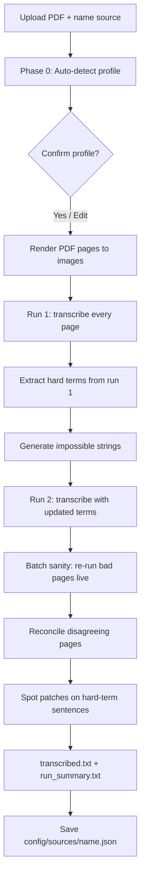

# PDF Transcribe Pipeline (v3)

How the Claude Opus vision pipeline works, what each step does, and how to run it so you end up with clean text and fewer surprises.

For the **whole repository** (Archive Studios + Gateway + shared `pipeline/`), see [ARCHITECTURE.md](./ARCHITECTURE.md).

**Core idea:** The scanned **page image is ground truth**. The pipeline never “fixes” spelling to modern standards. It transcribes exactly what is printed, uses two independent passes to catch mistakes, then reconciles disagreements and patches name-heavy sentences.

---

## Quick start (minimum steps)

1. Double-click **Launch PDF Transcribe.bat**
2. Drop your PDF (filename appears under the drop zone — that means it’s attached)
3. Enter a **source name** (e.g. `anales_de_tlatelolco`, `kaqchikel_chronicles`) — one name per book/edition
4. Leave **Test 10 pages** on for a first run
5. Click **Run — auto-detect & transcribe**
6. Review the **Detected source profile** → **Yes, proceed** (or **Edit overrides** if something looks wrong)
7. Wait for **Finished**, then open the results folder and read `transcribed.txt` and `run_summary.txt`

---

## End-to-end flow (diagram)



---

## Before you run: choices that affect quality and cost

| Setting | Recommended for first run | Why |
|--------|---------------------------|-----|
| **Test 10 pages** | Yes | Cheap sanity check on real content before a full book |
| **Skip first N pages** | `2` for Google Books scans; `0` if your PDF starts on page 1 | Skips boilerplate notice pages |
| **Cost & speed: Recommended** | Fast feedback on tests; batch on full book | Test = live API; full book = batch 50% off |
| **Always batch** | If you want 50% off even on 10-page tests | Slower queue wait, cheaper |
| **Spot-check checkbox** | Leave **on** | Fixes names/terms sentence-by-sentence without replacing whole pages |
| **Source name** | Required, stable per book | Drives saved profile and auto term files |

**Pilot pages** (optional field): e.g. `13,19,21,45-50` — overrides the 10-page test with specific PDF page numbers (good for edge cases you already know about).

---

## Phase 0 — Auto-detection (before any transcription)

**What happens:** The app renders your PDF, then sends **up to 10 sample page images** to Claude with a structured questionnaire.

**How samples are picked (not pure random):**
- **Consecutive page pairs** from the **first half** of the book (catches every-other-page Spanish/indigenous layouts)
- **Quartile anchors** across the full book (early, middle, late — so a late indigenous-only section doesn’t hide Spanish in the first half)
- Extra samples from the **first quarter** if needed

**What it detects:**
- Languages and rough **whole-book** percentages (e.g. Spanish 70%, Nahuatl 30%)
- Script (Latin, Arabic, CJK, etc.)
- Writing direction, era, footnotes, headers
- Up to **20 seed hard terms** (names, places, technical words)

**Saved to:** `state.json` → `detected_source_profile`

**Skipped when:** `config/sources/{source_name}.json` already exists from a prior successful run (same source name).

**Cost:** One live API call (multiple images in one request).

---

## Phase 0b — Confirm profile (UI)

You see a summary like:

```
Languages: Spanish 70%, Classical Nahuatl 30%
Script: latin
Direction: LTR
Era: ...
Footnotes: Yes
Seed hard terms: Tlatelolco, náhuatl, ...
```

| Button | Action |
|--------|--------|
| **Yes, proceed** | Lock profile and start transcription |
| **Edit overrides** | Override language and/or script, then **Save & proceed** |
| **Cancel** | Stop; no transcription charges |

**Sanity-check before Yes:**
- **Languages** — colonial books often mix Spanish + indigenous; both should appear if true
- **Script** — Latin for Spanish/Nahuatl/Kaqchikel in Latin letters
- **Direction** — should usually be **LTR** for Spanish/Nahuatl; **RTL** often means sideways sample pages confused detection (override if needed via re-run / future direction override)
- **Seed terms** — should look like real names from *your* book, not generic filler

**Auto-applied normalization rules:** Any language ≥10% gets archival rules (e.g. don’t modernize old Spanish `fué`, don’t strip Nahuatl macrons, don’t unify colonial Kaqchikel/Maya spelling). Rules are injected into transcription and patch prompts.

---

## Render — PDF to images

- Each PDF page → grayscale PNG at **300 DPI** (2576px long edge)
- Google Books **notice pages** (first N after skip) can be auto-skipped via local OCR heuristics
- Output: `{work_dir}/images/page_XXXX.png`

**Work directory:** `_pdf_transcribe_uploads/{pdf_stem}_transcribe_output/`

---

## Run 1 — First full pass

- Every page image → Claude Opus vision → verbatim transcription
- Prompt includes **language-specific archival rules** from detection
- Per-page files: `run1/page_XXXX.txt`
- Assembled: `run1.txt`

**Batch mode:** Pages submitted to Anthropic batch API (50% off); you wait on the queue.

**Skip lines (not errors):** `[Skipped: Google boilerplate]`, `[Skipped: blank page]`, `[Skipped: library stamp]`

---

## Extract hard terms (between run 1 and run 2)

**UI message:** `Extracting hard terms from run 1…`

1. Reads assembled **run 1** text
2. Claude extracts tokens: long words, proper nouns, non-standard spellings
3. **Merges** with Phase 0 seed terms (deduplicated)
4. Writes `config/hard_terms_auto_{source_name}.txt`
5. Claude generates **impossible strings** (plausible OCR typos that must never appear)
6. Writes `config/impossible_auto_{source_name}.txt`
7. Updates `state.json` with lists for run 2 and finalize

**Why:** Hard terms are built from *this book’s* content, not a generic list.

**Cost:** Two live API calls (extract + impossible strings).

---

## Run 2 — Second pass (with book-specific terms)

- Same pages, same images, **updated prompt** (normalization + book context from profile)
- Hard terms from step above inform spot-check later; transcription prompt uses normalization rules
- Output: `run2/page_XXXX.txt`, `run2.txt`
- `differences.txt` — pages where run 1 and run 2 differ (preview)

---

## Batch sanity pass (batch jobs only)

After run 2, each page output is checked:

| Check | Failure example |
|-------|-----------------|
| **Minimum length** | &lt; 50 characters on a non-blank image |
| **Script consistency** | Latin job but output is mostly non-Latin characters |

Failed pages are **automatically re-run on the live API** (full price for those pages only). Logged in `state.json` → `batch_collisions` and `run_summary.txt`.

---

## Reconcile — When run 1 and run 2 disagree on content

**UI message:** `Reconciling N pages…`

**Skipped when:** Run 1 and run 2 are identical after **removing all whitespace** (formatting-only diffs don’t waste API calls).

**When content differs:**
- Sends **page image + run 1 text + run 2 text** to Claude
- Model picks readings that match the **image**, not “what sounds right”
- Output: `reconcile/page_XXXX.txt`, `reconcile_log.txt`
- Uncertain pages get `UNCERTAIN: reason` and land in **human review** list

**Typical causes of disagreements:** Nahuatl names, old Spanish accents, footnote numbers vs superscripts, faded ink, sideways pages.

---

## Spot patches — Sentence-level name verification

**UI message:** `Spot patches: N sentences on M pages…`

**Not** a full-page re-transcription.

For each page (after reconcile):
1. Load best text so far (reconcile → else agreed run)
2. Find sentences containing **hard terms**
3. Bracket those terms in the sentence
4. One API call **per sentence** — verify brackets against the image
5. Replace only that sentence if patch passes validation

**Patch rejected (keeps original sentence) if:**
- Response contains an **impossible string**
- A required **hard term goes missing**
- Italic / structure rules fail validation

**Output:** `spot_check/page_XXXX.txt`, `spot_patch_log.txt`

Colonial name-heavy books can produce **many** sentence patches (e.g. 100+ on 10 pages) — normal.

---

## Final assembly — What you open first

| File | What it is |
|------|------------|
| **`transcribed.txt`** | **Final book** — one block per page (`--- Page N ---`) |
| **`run_summary.txt`** | Stats, human-review page list, batch collisions |
| `run1.txt` / `run2.txt` | Raw passes |
| `differences.txt` | Where pass 1 ≠ pass 2 |
| `reconcile_log.txt` | How disagreements were resolved |
| `state.json` | Job state, profile, completed pages (resume) |
| `progress.json` | Live UI status |

**Per-page priority in `transcribed.txt`:**  
`spot_check` → `reconcile` → run 1 (if run 1/run 2 only differ in whitespace) → else run 1

---

## Saved per-source config (re-runs)

After success: `config/sources/{source_name}.json`

```json
{
  "source_name": "anales_de_tlatelolco",
  "detected_languages": { "nahuatl": 0.3, "spanish": 0.7 },
  "detected_script": "latin",
  "hard_terms_file": "hard_terms_auto_anales_de_tlatelolco.txt",
  "impossible_strings_file": "impossible_auto_anales_de_tlatelolco.txt",
  "run_date": "...",
  "pages_processed": 10
}
```

**Same source name next time:** Skips Phase 0 detection; loads profile and term files.

**New book:** Use a **new source name**.

---

## How to get as close to zero errors as possible

### 1. Always pilot before a full book
- Run **10 pages** (or your own pilot list)
- Read `transcribed.txt` and `run_summary.txt`
- Check `human_review_pages` and `batch_collisions`

### 2. Name the source correctly once
- Stable slug: `anales_de_tlatelolco`, not a different string every run
- Re-runs reuse hard terms and skip detection

### 3. Review the detection profile
- Fix wrong language mix before **Yes, proceed**
- Ignore **RTL** on Latin Spanish/Nahuatl books unless the book is truly RTL
- Seed terms should match your manuscript

### 4. Skip Google front matter
- Google Books PDFs: **Skip first 2** (or more if needed)
- Set **0** only when page 1 is real content

### 5. Sideways or bad scans
- A few rotated phone photos: Claude often still reads them; worst case those pages land in reconcile or human review
- Many bad pages: fix rotation in the PDF **before** running (pipeline does not auto-rotate)

### 6. Keep spot-check enabled
- Protects names without risky full-page replacements

### 7. After a test run, spot-check these
- [ ] `run_summary.txt` → `human_review_pages` — open those PDF pages manually
- [ ] `batch_collisions` — pages that failed batch sanity and were re-run
- [ ] `differences.txt` — high disagreement count may mean hard scans or language detection off
- [ ] Random pages in `transcribed.txt` against the PDF image
- [ ] Footnotes: `--- FOOTNOTES ---` sections present where expected
- [ ] Hard terms file: `config/hard_terms_auto_{source}.txt` — sensible names; add lines manually if you know missing ones, then re-run (resume skips done pages)

### 8. Full book strategy
- **Recommended** processing: live test → batch full book
- Or **Always batch** for cheapest full run (longer wait)
- Full 976-page books: expect batch queue time; progress shows `Batch X / Y pages`

### 9. Resume after a crash
- Same PDF path + same work folder: completed pages in `state.json` are skipped
- Restart app and run again with same source name and PDF

---

## Processing modes (cost vs speed)

| Mode | Test (10 pages) | Full book |
|------|-----------------|-----------|
| **Recommended** | Live API (minutes) | Batch 50% off |
| **Always live** | Live | Live (full price) |
| **Always batch** | Batch 50% off | Batch 50% off |

Detection and hard-term extraction always use **live** API calls (small extra cost).

---

## Supported language profiles (auto normalization)

Includes: **spanish**, **nahuatl**, **kaqchikel**, **yucatec_maya**, **classical_maya**, **korean**, **japanese**, **arabic** — rules apply when detection percentage ≥10%.

**Kaqchikel Chronicles / Memorial de Sololá:** Expect Spanish + Kaqchikel mix; Latin script; colonial spelling preserved.

**Anales de Tlatelolco:** Expect Spanish + Nahuatl; name-heavy spot patches.

---

## CLI (optional)

```bash
python pdf_transcribe.py book.pdf --source-name anales_de_tlatelolco --yes --max-pages 10
```

| Flag | Purpose |
|------|---------|
| `--source-name` | Source id for profile and term files |
| `--yes` | Auto-confirm detection (no UI) |
| `--max-pages 10` | Test run |
| `--pages 13,19,21` | Explicit PDF pages |
| `--skip-front-pages 2` | Skip Google notice |
| `--processing batch` | Force batch |

---

## Troubleshooting

| Symptom | Likely cause | What to do |
|---------|--------------|------------|
| “Name this source” | Empty source name field | Fill **Source name** before Run |
| JSON / `<!doctype` error | Old server tab or cached JS | Close tab; reopen **Launch PDF Transcribe.bat**; Ctrl+F5 |
| `progress.json` missing | Output dir not created (fixed in v3) | Update app; re-run |
| `load_impossible_strings` error | Old code before wrapper fix | Pull latest; re-run (runs resume) |
| Stuck on batch | Anthropic queue | Normal; wait or use live for tests |
| Wrong language in output | Bad detection | New source name or delete `config/sources/{name}.json`; re-detect; use Edit overrides |
| Many reconcile pages | Hard scan or bilingual complexity | Expected; check `reconcile_log.txt` |
| Huge spot patch count | Name-heavy text | Expected for colonial books |

---

## Philosophy (why two runs + reconcile + patches)

1. **Two passes** — independent mistakes rarely coincide  
2. **Whitespace-only reconcile skip** — don’t pay to fix spacing  
3. **Image reconcile** — content disagreements resolved from the scan, not guesswork  
4. **Sentence patches** — fix names without replacing whole pages  
5. **Impossible strings** — block plausible typos on names  
6. **Intent-based detection** — you confirm the machine’s reading of the book before spending on hundreds of pages  

You are not expected to be a linguist upfront. You **confirm** what the pipeline inferred, pilot **10 pages**, then scale.

---

## Version

Pipeline **v3** — intent-based auto-detection, stratified sampling, per-source auto hard terms, batch sanity, sentence-level spot-check v2.

App entry: `pdf_transcribe_ui.py` · Port **8765** · Tests: `python scripts/test_transcribe_logic.py`
